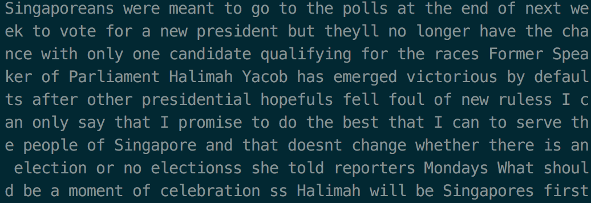
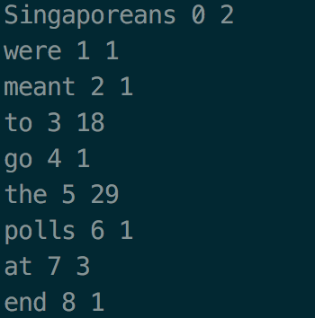

# Introduction

This [hw0](http://speech.ee.ntu.edu.tw/~tlkagk/courses/ML_2017_2/Lecture/HW0.pdf) is the prerequiste to have a draw for attending Hung-yi Lee‘s Machine Learning course.

All we have to show is the ability to handle git and basic usage of Python module and syntax.

# Usage

All the resources are provided by the course.

Q1

    ./Q1.sh <DATA_FILE_PATH>

<figure style="text-align: center;">
    
    <figcaption style="display: block;">Original Data</figcaption>
    
    <figcaption style="display: block;">Data Count</figcaption>
</figure>

and it will produce Q1.txt

Q2
    
    Q2.sh <IMAGE_FILE_PATH>

and it will produce Q2.txt

<figure style="text-align: center;">
    
    <figcaption style="display: block;">Westbrook</figcaption>
    
    <figcaption style="display: block;">Dimmed Westbrook</figcaption>
</figure>

# Reference

http://speech.ee.ntu.edu.tw/~tlkagk/courses/ML_2017_2/Lecture/HW0.pdf